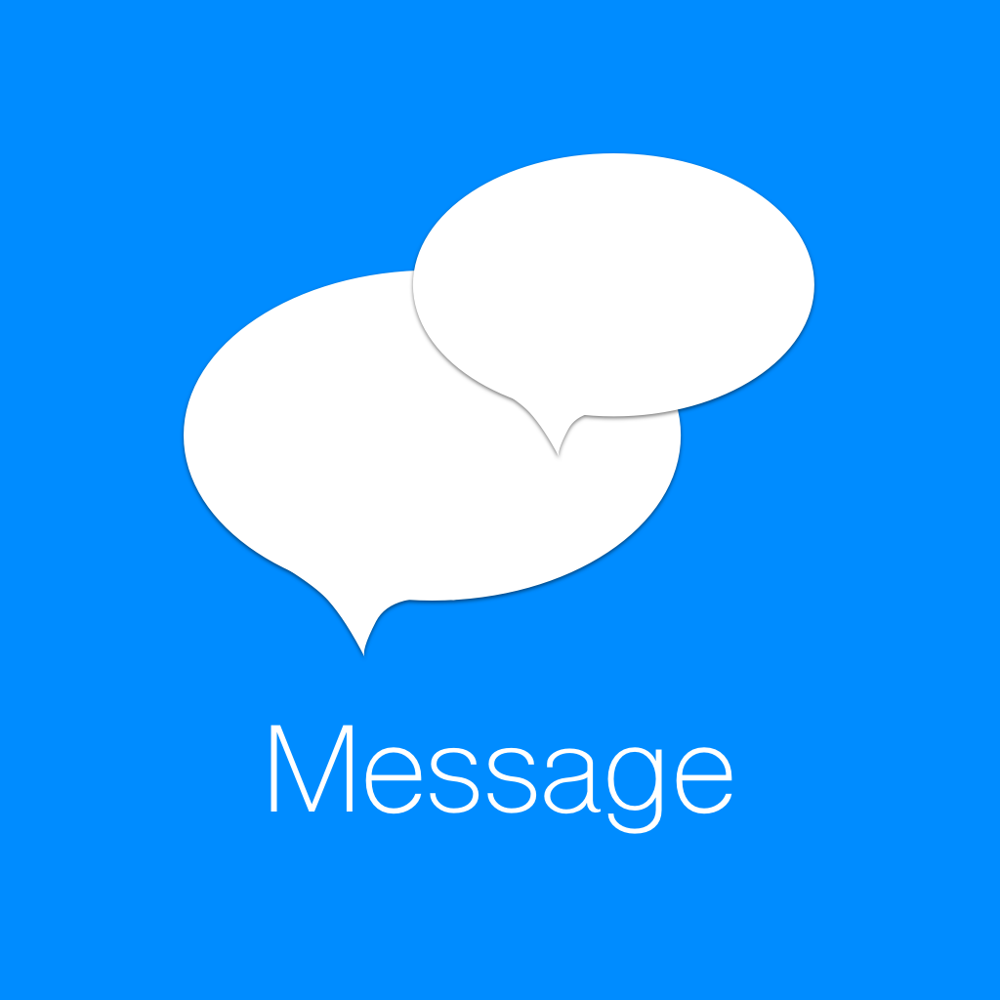

# SimpleMessage

Простой пример реализации мессенджера, выполненный с душой.

  - Авторизуйтесь
  - Общайтесь в чате
  - Просматривайте свои фотографии на странице профиля

# Наши фичи!

  - Добавлена симуляция общения.
  - Попробуйте обратиться к Биллу Гейтсу с сообщением "Когда сделаете нормальный тачпад?)" посмотрите, что он ответит )
  - Попробуйте обратиться к Тиму Куку с сообщением "У тебя есть яблоки?" он тоже ответит )

Также вы можете:
  - Смотреть информацию по пользователю на отдельном экране
  - Листать фотографии в нашем слайдере

### Над проектом работали

* **Станислав** - Мастер углубляться и докапываться до сути вещей.
* **Денис Вайрус** - Человек с развитым чувством прекрасного.
* **Александр Лукаш** - Опытный лидер, прекрасный наставник, двигатель нашего локомотива.
* **Дмитрий Дьячков** - Стажер на подхвате, генератор шутеек и просто хороший парень.
